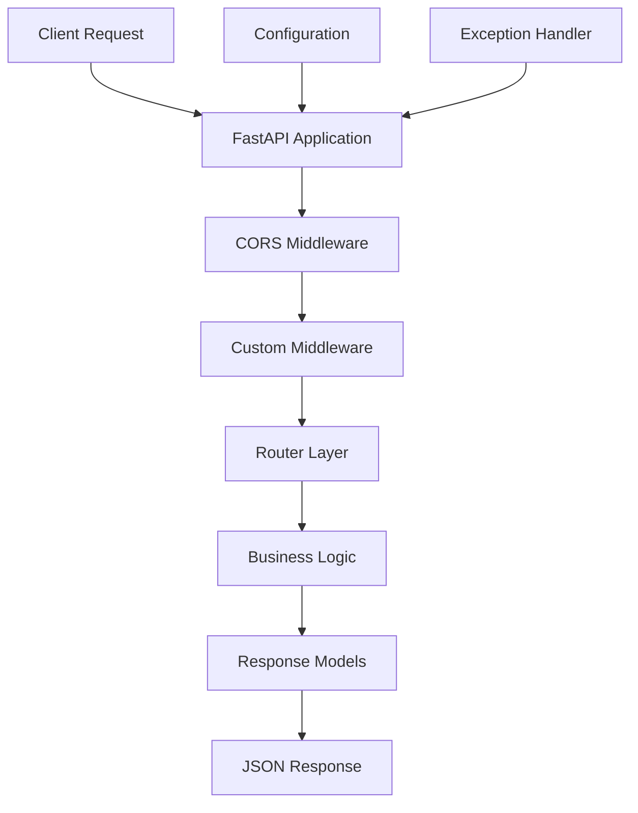

# Functional Documentation

## 🎯 Overview

The **Vibe Coding Extended API** is a FastAPI-based REST API that provides greeting and motivational services with a focus on positive developer experience. The application follows modern Python best practices and provides a scalable, modular architecture for future enhancements.

**Current Version**: 1.0.0  
**API Base URL**: `/api/v1`  
**Documentation**: Available at `/docs` (Swagger UI) and `/redoc` (ReDoc)

## 🏗️ Application Architecture

### Core Components



### Module Structure
- **`app/main.py`**: Application entry point and configuration
- **`app/core/config.py`**: Environment settings and configuration management  
- **`app/api/routes/greetings.py`**: Greeting endpoints and business logic
- **`app/api/middleware.py`**: Custom middleware for request processing
- **`app/models/`**: Data models (future expansion)
- **`app/services/`**: Business services (future expansion)

## 📡 API Endpoints

### Health Check Endpoints

#### `GET /`
**Purpose**: Root health check endpoint  
**Authentication**: None required  
**Rate Limit**: None  

**Response**:
```json
{
  "message": "Welcome to Vibe Coding Extended API! ✨",
  "status": "healthy",
  "version": "1.0.0",
  "environment": "development",
  "docs_url": "/docs"
}
```

**Use Cases**:
- API availability verification
- Service discovery
- Load balancer health checks

---

#### `GET /health`
**Purpose**: Detailed health status endpoint  
**Authentication**: None required  
**Rate Limit**: None  

**Response**:
```json
{
  "status": "ok",
  "timestamp": 1693248123.456789,
  "version": "1.0.0",
  "environment": "development"
}
```

**Use Cases**:
- Monitoring and alerting systems
- Detailed service diagnostics
- Uptime tracking

---

### Greeting Endpoints

#### `GET /api/v1/hello`
**Purpose**: Simple "Hello World" greeting with positive vibes  
**Authentication**: None required  
**Rate Limit**: None  

**Response Model**: `GreetingResponse`
```json
{
  "message": "Hello World! Welcome to Vibe Coding Extended! 🎉",
  "timestamp": "2025-08-26T16:45:30.123456",
  "vibe_level": "✨ Fantastic",
  "emoji": "🚀"
}
```

**Business Logic**:
- Returns static welcome message
- Generates current timestamp in ISO format
- Randomly selects vibe level from 6 options
- Randomly selects emoji from 10 options

**Use Cases**:
- API functionality verification
- Basic integration testing
- Welcome screens for applications

---

#### `GET /api/v1/hello/{name}`
**Purpose**: Personalized greeting with user's name  
**Authentication**: None required  
**Rate Limit**: None  

**Path Parameters**:
- `name` (string, required): User's name to personalize greeting

**Query Parameters**:
- `vibe` (string, optional): Custom vibe level override

**Response Model**: `PersonalizedGreetingResponse`
```json
{
  "message": "Hello Alice! Ready to code with amazing vibes?",
  "name": "Alice",
  "timestamp": "2025-08-26T16:45:30.123456",
  "vibe_level": "🌟 Amazing",
  "emoji": "💫",
  "fun_fact": "Did you know? Python was named after Monty Python's Flying Circus!"
}
```

**Validation Rules**:
- Name length: 1-50 characters
- Name cannot be empty or whitespace only
- Name is automatically title-cased

**Error Responses**:
```json
// Name too long (400)
{
  "detail": "Name too long! Keep it under 50 characters."
}

// Empty name (400)
{
  "detail": "Name cannot be empty!"
}
```

**Business Logic**:
- Validates and sanitizes input name
- Generates personalized greeting message
- Allows custom vibe level or uses random selection
- Includes random programming fun fact

**Use Cases**:
- User onboarding flows
- Personalized dashboard greetings
- Custom user experiences

---

#### `GET /api/v1/greetings/random`
**Purpose**: Random motivational coding message  
**Authentication**: None required  
**Rate Limit**: None  

**Response Model**: `GreetingResponse`
```json
{
  "message": "Time to create something amazing! 🚀",
  "timestamp": "2025-08-26T16:45:30.123456",
  "vibe_level": "🎵 Groovy",
  "emoji": "🌈"
}
```

**Message Pool** (8 motivational messages):
1. "Time to create something amazing! 🚀"
2. "Let's code with passion and purpose! ✨"
3. "Every line of code is a step toward greatness! 🌟"
4. "Ready to turn caffeine into code? ☕💻"
5. "Debug like a detective, code like an artist! 🎨"
6. "The only way to do great work is to love what you do! 💝"
7. "Code is poetry written in logic! 📝✨"
8. "Think twice, code once, celebrate always! 🎉"

**Use Cases**:
- Daily motivation features
- Loading screen messages
- Inspirational developer tools

---

#### `GET /api/v1/greetings/stats`
**Purpose**: System statistics and metadata  
**Authentication**: None required  
**Rate Limit**: None  

**Response**:
```json
{
  "total_vibe_levels": 6,
  "total_emojis": 10,
  "total_fun_facts": 6,
  "available_endpoints": [
    "/hello",
    "/hello/{name}",
    "/greetings/random",
    "/greetings/stats"
  ],
  "vibe_energy": "Maximum! 🔥"
}
```

**Use Cases**:
- API discovery and documentation
- System monitoring and metrics
- Feature availability checking

---

## 🔧 System Features

### Middleware Components

#### CORS Middleware
**Purpose**: Cross-Origin Resource Sharing support for frontend integration  
**Configuration**:
- Allowed origins: `localhost:3000`, `localhost:8000`, `127.0.0.1:3000`, `127.0.0.1:8000`
- Credentials: Enabled
- Methods: All (`*`)
- Headers: All (`*`)

#### Custom Process Time Middleware
**Purpose**: Performance monitoring and request tracking  
**Functionality**:
- Measures request processing time
- Adds `X-Process-Time` header to all responses
- Adds `X-Powered-By: Vibe-Coding-Extended` header

### Exception Handling
**Global Exception Handler**: Catches unhandled exceptions and returns structured error responses

**Development Mode**:
```json
{
  "message": "Internal server error",
  "detail": "Actual error message"
}
```

**Production Mode**:
```json
{
  "message": "Internal server error",
  "detail": "Something went wrong"
}
```

### Configuration Management
**Environment-Based Configuration**: Uses Pydantic Settings for type-safe configuration

**Configuration Categories**:
- **Project Information**: Name, description, version
- **Environment Settings**: Development/production modes
- **API Configuration**: Base paths, versioning
- **CORS Settings**: Allowed origins and methods
- **Security Settings**: Secret keys, token expiration (future)
- **Database Configuration**: Connection strings (future)

## 📊 Data Models

### GreetingResponse
```python
class GreetingResponse(BaseModel):
    message: str          # Main greeting message
    timestamp: str        # ISO format timestamp
    vibe_level: str       # Motivational vibe description
    emoji: str           # Visual emoji representation
```

### PersonalizedGreetingResponse
```python
class PersonalizedGreetingResponse(BaseModel):
    message: str          # Personalized greeting message
    name: str            # Cleaned/formatted user name
    timestamp: str        # ISO format timestamp
    vibe_level: str       # Motivational vibe description
    emoji: str           # Visual emoji representation
    fun_fact: str        # Programming-related fun fact
```

## 🎨 Business Logic

### Vibe System
**Vibe Levels** (6 options with emojis):
- 🌟 Amazing
- ✨ Fantastic  
- 🎵 Groovy
- 🚀 Epic
- 💫 Stellar
- 🎉 Wonderful

**Emoji Pool** (10 options):
`😊`, `🎉`, `✨`, `🌟`, `🎵`, `🚀`, `💫`, `🎊`, `🌈`, `🎯`

### Fun Facts System
**Programming Facts** (6 educational tidbits):
1. Python naming origin (Monty Python)
2. First computer bug history (Grace Hopper, 1947)
3. Chess complexity vs universe atoms
4. "Debugging" term origin
5. JavaScript creation timeline (10 days)
6. Email '@' symbol history (1971)

### Name Processing Logic
**Input Sanitization**:
1. Trim whitespace from input
2. Validate length (1-50 characters)
3. Check for empty strings
4. Apply title case formatting
5. Return cleaned name

## 🔄 Request/Response Flow

### Typical Request Flow
1. **Client Request** arrives at FastAPI application
2. **CORS Middleware** validates origin and adds CORS headers
3. **Custom Middleware** starts timing and adds custom headers
4. **Router** matches URL pattern to appropriate endpoint
5. **Validation** processes path/query parameters using Pydantic
6. **Business Logic** executes endpoint-specific functionality
7. **Response Model** validates and serializes response data
8. **Middleware** adds final headers (process time, powered-by)
9. **JSON Response** sent back to client

### Error Handling Flow
1. **Validation Errors**: Handled by FastAPI automatically (422 status)
2. **Business Logic Errors**: Raised as HTTPException (400 status)
3. **Unhandled Errors**: Caught by global exception handler (500 status)

## 🚀 Performance Characteristics

### Response Times
- **Health endpoints**: < 5ms
- **Simple greeting**: < 10ms  
- **Personalized greeting**: < 15ms
- **Random greeting**: < 10ms
- **Stats endpoint**: < 5ms

### Memory Usage
- **Base application**: ~50MB
- **Per request**: ~1-2MB
- **Concurrent requests**: Scales with available RAM

### Scalability
- **Async support**: All endpoints use async/await
- **Stateless design**: No server-side sessions
- **Horizontal scaling**: Ready for multiple instances
- **Database ready**: Architecture supports future database integration

## 🔮 Future Enhancements

### Planned Features
1. **User Authentication**: JWT-based authentication system
2. **Database Integration**: Persistent storage for user preferences
3. **Custom Greetings**: User-defined greeting messages
4. **Analytics**: Usage tracking and statistics
5. **Rate Limiting**: API usage controls
6. **Caching**: Redis-based response caching
7. **WebSocket Support**: Real-time greeting updates
8. **Multi-language**: Internationalization support

### Extension Points
- **`app/models/`**: Database models and schemas
- **`app/services/`**: Business logic services  
- **`app/utils/`**: Utility functions and helpers
- **Additional routers**: New API endpoint groups
- **Background tasks**: Async job processing

## 🔍 Monitoring and Observability

### Built-in Monitoring
- **Health checks**: System status endpoints
- **Process timing**: Request duration tracking
- **Error handling**: Structured error responses
- **Environment awareness**: Development vs production modes

### Integration Ready
- **Logging**: Python logging framework compatible
- **Metrics**: Ready for Prometheus/Grafana integration
- **Tracing**: OpenTelemetry compatible
- **APM**: Application Performance Monitoring ready

## 🎯 Use Cases and Applications

### Developer Tools
- **IDE Extensions**: Motivational messages in development environments
- **CI/CD Integration**: Build success/failure notifications
- **Code Review Tools**: Positive reinforcement systems

### Educational Platforms
- **Learning Management**: Student progress encouragement
- **Coding Bootcamps**: Daily motivation features
- **Tutorial Platforms**: Progress celebrations

### Business Applications
- **Team Dashboards**: Employee recognition systems
- **Project Management**: Milestone celebrations
- **Company Portals**: Welcome and onboarding flows

### Integration Examples
- **Frontend Applications**: React/Vue.js greeting components
- **Mobile Apps**: iOS/Android motivation features
- **Desktop Software**: System tray notifications
- **Web Extensions**: Browser-based productivity tools

---

## 📚 Additional Resources

- **OpenAPI Schema**: Available at `/api/v1/openapi.json`
- **Interactive Documentation**: Swagger UI at `/docs`
- **Alternative Documentation**: ReDoc at `/redoc`
- **Source Code**: GitHub repository with comprehensive examples
- **Test Suite**: Pytest-based functional and integration tests

**Last Updated**: August 26, 2025  
**Document Version**: 1.0.0  
**API Version**: 1.0.0
